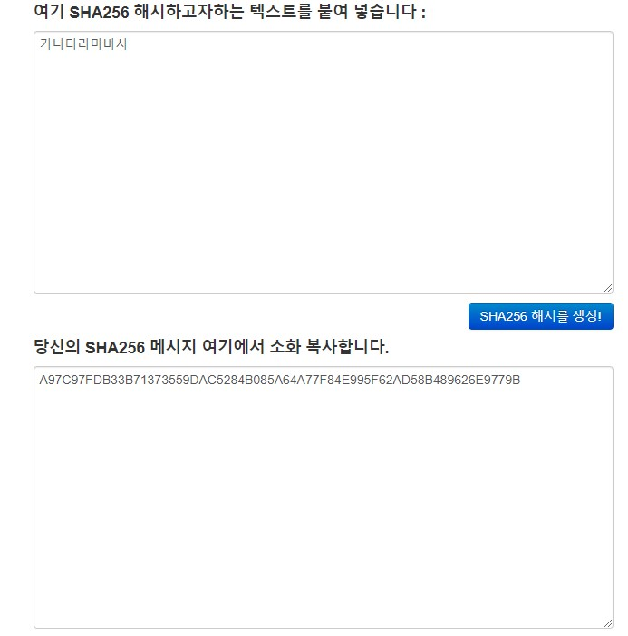
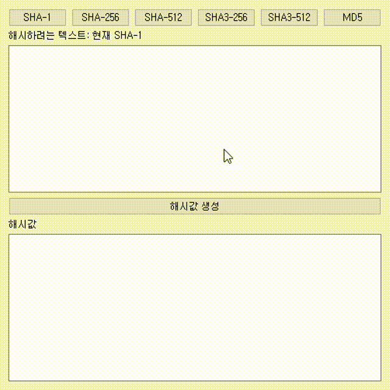

목차
===
> * 1.암호화 해시 함수?
> * 2.PyQt5의 사용 가이드
> * 3.PyInstaller의 사용 방법
> * 4.진행 내용

1.암호화 해시 함수?
==============
암호화 해시 함수란, [위키피디아:암호화 해시 함수][1]에 따르면: 

> * 암호화 해시 함수는 해시 함수의 일종으로, 해시값으로부터 원래의 입력값과의 관계를 찾기 어려운 성질을 가지는 경우를 의미한다. *

예를 들어, 해시 함수가 y=x같이 해시값(y)로부터 키값(x)를 알기 쉬운 경우, 암호화 해시 함수에 해당될 수 없습니다. 암호화된 상태의 해시값을 보냈을 때 해킹 공격에 취약할 수 밖에 없겠군요.

암호화 함수는 다음의 세 가지 성질을 만족해야합니다.

작성자의 편의상, 아래 설명은 해시 함수 f, 키값 x, 해시값 y에 대해 y=f(x)의 관계가 성립할 것을 가정합니다.

1. 역상 저항성(preimage resistance): 어떤 y를 이용해 x를 찾는 것이 계산상 어렵다.
2. 제 2 역상 저항성(second preimage resistance): 어떤 x에 대응되는 y가 있을 때, y를 바꾸지 않으면서 x를 변경하는 것이 계산상 어렵다.
3. 충돌 저항성(collision resistance): 해시 충돌에 안전함. 어떤 y를 생성하는 서로 다른 x를 찾는 것이 어려움.

다시 말해서, 아래와 같이 요약할 수 있을 것 같습니다.

1. 해시값을 이용한 역방향 계산이 어려울 것
2. 기존 키값과 다른 키값을 입력했을 때 기존 해시값과 다른 해시값이 출력될 것
3. 서로 다른 키값이 같은 해시값을 출력하지 않을 것

이에 대해 [JSPark님이 서술하신 괜찮은 예시][2]가 있는데, 간단히 요약하면 y=f(x)=x^2과 같은 1:1 대응이 아닌 함수는 f(2)=f(-2)=4로, 키값-해시값이 1:1대응이 되지 않아 원래 값을 알기 어렵습니다.

암호화 해시 함수의 종류
---------------------
**암호화 해시 함수의 종류**에는 SHA-0, SHA-1, SHA-256/224, SHA-512/384, SHA3-256/224, SHA3-512/384, MD5가 있습니다.

SHA-0는 1993년 NSA에서 설계한 함수로, 정식 명칭은 SHA(Secure Hash Algorithm)입니다만 구분을 위해 SHA-0로 표기하며, SHA-1, SHA-256/224, SHA-512/384는 SHA-0의 변형입니다.

SHA-3군은 비교적 최근인 2012년 10월에 공모전에서 최종 우승하여 표준안으로 선정된 알고리즘으로, 2015년에 NIST에서 SHA-3 표준을 발표했습니다. SHA-2군은 현재도 많이 쓰이고 있다고 합니다만, SHA-2군의 해시 알고리즘이 가까운 미래에 깨질 수 있어 안전하지 않다는 의견에 따라 새로운 알고리즘을 사용하는 SHA-3군에 대한 공모가 열린 것이라고 합니다.

[2012년 기사][3]에 따르면 SHA-2가 일정 기간동안은 일반적 용도로 사용되는데 문제가 없을 것이라고 합니다. 코인이나 블록체인쪽은 잘 모릅니다만 SHA-2군을 사용하는 예시로 비트코인이 있고, 그외 다양한 분야에서도 사용될 것으로 생각됩니다.보안이 철저해야할 코인 쪽에서 아직 SHA-2군을 사용한다는 것을 보면 아직 보안 이슈는 크지 않은 것이 아닌가 싶습니다.

그 외로 MD5 알고리즘이 있는데, [위키피디아:MD5][4]에 따르면 1996년에 이미 MD5의 보안 이슈가 발견되어 다른 알고리즘을 사용할 것이 권고되었고, 2008년에는 MD5의 결함을 이용해 SSL 인증서를 변조하는 것이 가능함이 발표되었다고 합니다.

해시 vs 암호화
--------------
해시값을 만드는 것과 암호화는 다릅니다.

해시값을 만들면 원래 값을 알 수 없습니다. 위에서도 설명했듯이, 암호화 해시 함수는 해시값을 이용해서 키값을 알기 어려워야 합니다.

암호화는 입력값을 암호화했을 때, 복호화 가능해야 합니다. 

그렇다면 해시값을 어디에 어떻게 쓰는지가 궁금해집니다. 원래 값을 다시 만들 수 없는데, 어디에 쓰는걸까요?

[se-you님이 정리하신 자료][5]에 따르면, 데이터베이스에 비밀번호를 저장할 때 비밀번호를 해시함수에 넣어서 나온 해시값을 데이터베이스에 저장하면 해커의 공격에 안전할 수 있다고 합니다. 사용자가 어떤 비밀번호를 입력했을 때, 입력된 값을 해시함수에 넣어서 데이터베이스에 저장된 아이디-(해시화된)비밀번호 쌍과 대입해보면 비밀번호가 맞는지 확인할 수 있겠네요.

hashlib
---------
다행스럽게도, Python을 사용한다면 해시 알고리즘이 hashlib이라는 라이브러리에서 제공됩니다!
[공식 링크]:https://docs.python.org/3/library/hashlib.html

SHA-1부터 SHA3-256도 있고, MD5나 그 외의 암호화 해시 함수가 제공됩니다.

2.PyQt5
====================
PyQt5는 Python에서 활용할 수 있는 GUI 라이브러리입니다.

원래 C++에서 사용할 수 있는 GUI 라이브러리가 Qt인데, 이 라이브러리를 Python에 이식하면서 Python의 간결함을 살릴 수 있는 라이브러리로 발전시켰다고 합니다.

실제로, 사용해보았더니 굉장히 편리하며 GUI의 세계에 쉽게 입문할 수 있도록 도울 수 있는 훌륭한 라이브러리가 아닌가 싶습니다.

기본적인 가이드는 Dardo님이 저술하신 PyQt5 Tutorial([wikidocs link][6])에 잘 서술되어 있어 추가적인 서술은 삼가겠습니다. 서술된 내용을 따라가시다보면, Python 스킬이 높은 편이 아니시더라도 쓸만한 GUI 어플리케이션을 제작할 수 있을 것입니다.

스킬이 늘어나고 시간이 남는다면 자필로 가이드를 작성해보아야겠습니다.

3.PyInstaller
=============
PyQt5를 이용해서 GUI 프로그램을 만들었다면, 사용하기 쉽게 exe 파일로 실행할 수 있게 만들고싶어집니다. 이 경우의 해결책이 PyInstaller입니다.

기본 사용방법
------------
PyInstaller는 .py 파일을 실행파일로 만들어주는 라이브러리로, 역시 간단하며 사용하기 쉽습니다. 기본적인 사용 방법은 위의 PyQt5 위키독스에 잘 서술되어 있습니다만, 간단히 요약하자면 다음과 같습니다.

* 설치
> pip install pyinstaller

* 기본 사용 방법
> pyinstaller test.py

명령어를 실행하면 test.py가 위치한 폴더에 dist/ 폴더가 생성되며, 이 폴더 안에 실행 파일이 위치하게 됩니다. 

추가 옵션
----------
이 때 생성되는 test.spec 파일은 exe 파일 생성 방법을 지시하는 파일인데, 이 파일 안의 상수들을 '적절히' 변경하면 app 이름을 바꾸는 등의 변경을 할 수 있습니다.

이때 어떤 옵션도 없이 실행하면 실행 시 까만 cmd창이 같이 뜨고, exe파일만 나오는 것이 아니라 여러 파일이 함께 dist 폴더 안에 존재하게 됩니다.

프로그램 창만 띄우고싶다면 --windowed 옵션을 추가합니다.

* GUI 프로그램 창만 띄우기
> pyinstaller --windowed test.py

여러 파일이 아니라 exe 파일 하나만 나오게 하고싶다면, --onefile 옵션을 추가합니다.

* exe 파일만
> pyinstaller --onefile test.py

exe 파일의 아이콘을 설정하고싶다면 --icon *icon위치* 옵션을 추가합니다.

* 아이콘
> pyinstaller test.py --icon icon.png

PyQt5와 관련된 이슈
-------------------
왜 그런지는 잘 모르겠습니다만, PyQt5를 함께 이용할 때 exe파일이 제대로 실행되지 않는 이슈가 있습니다.

실행이 잘 안 된다면, [.py 위치한 폴더]/dist/[app_name]/PyQt5/Qt/bin/에 PyQt5의 모든 bin 파일을 붙여넣기합니다.

PyQt5의 모든 bin 파일은 Python을 설치하신 폴더에서 가져오는데, 구체적인 위치는 [Python 설치 위치(ex:C:\Python37)]/Lib/site-packages/PyQt5/Qt/bin/ 입니다.

참고로 CLI에서 exe를 실행하면 에러 메시지를 볼 수 있으니 유용하게 활용하시길 바랍니다.

4.진행 내용
===========
의뢰자 분은 암호화 해시 함수를 이용해서 키값을 입력했을 때 해시값을 보여주는 프로그램을 요청하셨습니다.

예시로 보여주신 그림이 다음과 같았는데, 아마 [온라인 해시 생성기 페이지][7]를 보고 요청하신게 아닌가 싶습니다.

찾아본 결과 1.암호화 해시 함수 에서 서술한 바와 같이 많은 해시 함수가 있었고, 분명 Python에 라이브러리가 있을것 같아 찾아본 결과 hashlib에서 충분히 많은 암호화 해시 함수를 제공하는 것을 알게되었습니다. 그래서 하는 김에 한 6개 정도는 같이 해드릴 수 있겠다 싶어 진행을 했습니다.

제작 결과는 다음과 같습니다.

프로그램을 생각보다 간단하게 완성했는데, 전적으로 PyQt5와 hashlib의 간편함덕분이 아니었나 싶습니다.

코드는 공개되어있으며, 다음 링크에서 확인하실 수 있습니다([링크][8])

[1]: https://ko.wikipedia.org/wiki/암호화_해시_함수
[2]: https://jsungpark.tistory.com/35
[3]: https://www.boannews.com/media/view.asp?idx=33102&kind=1
[4]: https://ko.widipedia.org/wiki/MD5
[5]: https://se-you.tistory.com/11
[6]: https://wikidocs.net/book/2165
[7]: https://www.convertstring.com/ko/Hash/SHA256
[8]: https://github.com/yangkyeongmo/hash_encription
